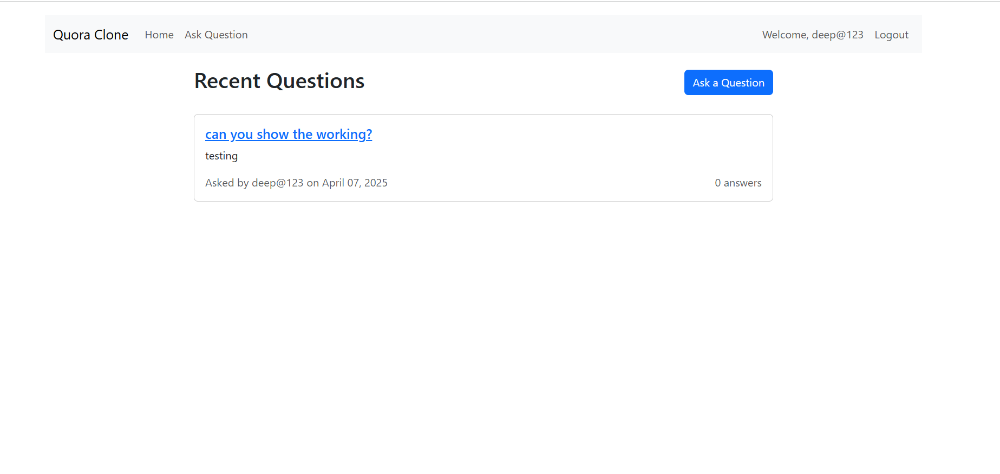
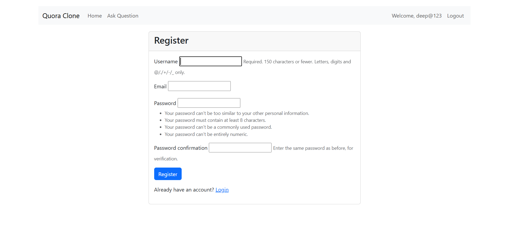
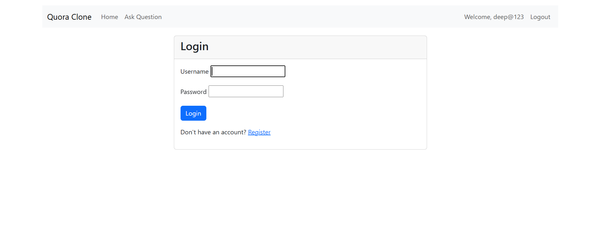
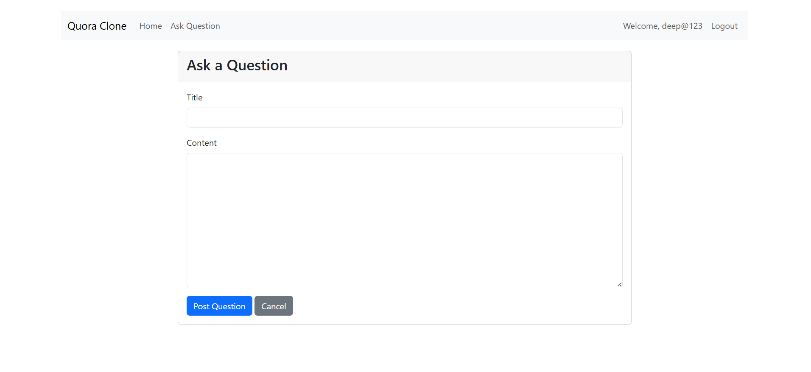

# Quora Clone - Django Web Application

A functional Quora-inspired Q&A web application built with Django. This project was developed as part of the TransportSimple Django Developer recruitment process.

## Features

- **User Authentication**: Register, login, and logout functionality
- **Question Management**: Post and view questions
- **Answer System**: Answer questions posted by other users
- **Interaction**: Like answers posted by other users
- **Responsive Design**: Built with Bootstrap for a clean, responsive interface

## Screenshots

### Home Page

*The home page displays all questions posted by users.*

### User Registration

*New users can create an account through this registration form.*

### Login Page

*Registered users can log in through this page.*

### Question Detail

*View a specific question, its answers, and add your own answer.*

### Ask Question

*Logged-in users can post new questions.*

## Technology Stack

- **Backend**: Django 5.2
- **Frontend**: HTML, CSS, Bootstrap 5
- **Database**: SQLite (default Django database)
- **JavaScript**: jQuery for AJAX functionality

## Installation & Setup

1. Clone the repository:
   ```bash
   git clone https://github.com/WaghmareDeepali/Quora_clone.git
   cd Quora_clone
   ```

2. Create and activate a virtual environment:
   ```bash
   python -m venv venv
   # On Windows
   venv\Scripts\activate
   # On macOS/Linux
   source venv/bin/activate
   ```

3. Install the required dependencies:
   ```bash
   pip install -r requirements.txt
   ```

4. Apply migrations:
   ```bash
   python manage.py migrate
   ```

5. Create a superuser (for admin access):
   ```bash
   python manage.py createsuperuser
   ```

6. Run the development server:
   ```bash
   python manage.py runserver
   ```

7. Visit http://127.0.0.1:8000/ in your browser to see the application.

## Project Structure

```
quora_clone/
├── quora_clone/           # Project configuration
├── questions/             # Main application
│   ├── migrations/        # Database migrations
│   ├── templates/         # HTML templates
│   ├── admin.py           # Admin configuration
│   ├── forms.py           # Form definitions
│   ├── models.py          # Database models
│   ├── urls.py            # URL routing
│   └── views.py           # View functions
├── templates/             # Project-level templates
├── static/                # Static files (CSS, JS)
├── manage.py              # Django management script
└── requirements.txt       # Project dependencies
```

## How to Use

1. **Register a new account** or log in with an existing one
2. **Browse questions** on the home page
3. **View question details** by clicking on a question
4. **Post answers** to questions
5. **Like answers** that you find helpful
6. **Ask your own questions** using the "Ask Question" button

## Future Improvements

- Comment functionality for answers
- User profiles with activity history
- Search functionality
- Tags for questions
- Notifications system

## Author

- **Deepali Waghmare**

## License

This project is licensed under the MIT License - see the LICENSE file for details.

## Acknowledgements

- TransportSimple for the project requirements
- Django documentation for the excellent resources
- Bootstrap for the frontend framework